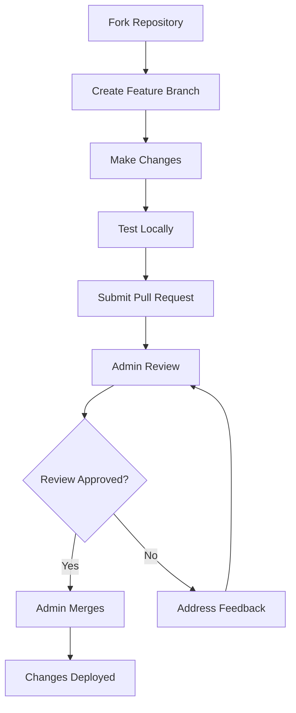

# Contributing to AWS Account Module - Terragrunt

Thank you for your interest in contributing to the AWS Account Module Terragrunt project! This document outlines the process for contributing to this repository and helps ensure a smooth collaboration experience.

## 🎯 Project Overview

This project provides enterprise-grade AWS Landing Zone automation using Terragrunt. We welcome contributions that improve functionality, add new features, fix bugs, enhance documentation, or provide additional examples.

## 🔄 Development Workflow

Our development process follows a simple and straightforward workflow designed to maintain code quality while enabling efficient collaboration.

### Process Overview



### Step-by-Step Process

1. **Fork the Repository**
   ```bash
   # Fork the repository on GitHub
   # Then clone your fork locally
   git clone https://github.com/YOUR_USERNAME/aws-account-module-terragrunt.git
   cd aws-account-module-terragrunt
   ```

2. **Create a Feature Branch**
   ```bash
   # Create and switch to a new branch
   git checkout -b feature/your-feature-name
   
   # Examples:
   # git checkout -b feature/add-cost-allocation-tags
   # git checkout -b bugfix/fix-email-validation
   # git checkout -b docs/update-examples
   ```

3. **Make Your Changes**
   - Follow the coding standards outlined below
   - Add tests for new functionality
   - Update documentation as needed
   - Ensure your changes work with existing examples

4. **Test Locally**
   ```bash
   # Validate Terraform syntax
   terraform fmt -check -recursive
   terraform validate
   
   # Validate Terragrunt configuration
   terragrunt validate
   
   # Run security checks
   checkov -d . --framework terraform
   
   # Test with example configurations
   terragrunt plan --terragrunt-config-path examples/simple-startup.hcl
   ```

5. **Submit Pull Request**
   ```bash
   # Push your changes
   git push origin feature/your-feature-name
   
   # Create a Pull Request on GitHub targeting the main branch
   ```

6. **Admin Review Process**
   - All pull requests must be reviewed and approved by a repository admin
   - Only admins can merge pull requests into the main branch
   - Admins may provide feedback or request changes
   - The review process ensures code quality and project consistency

## 📋 Branch Protection Rules

This repository implements the following branch protection rules:

### Main Branch Protection
- ✅ **Require pull request reviews** - All changes must go through PR review
- ✅ **Require review from admins** - Only repository admins can approve PRs
- ✅ **Dismiss stale reviews** - New commits dismiss previous approvals
- ✅ **Require status checks** - CI/CD pipeline must pass
- ✅ **Require branches to be up to date** - Must be current with main branch
- ✅ **Restrict pushes to admins only** - Direct pushes only allowed for admins

### Admin Privileges
- 🔑 **Merge without review** - Admins can merge their own changes (emergency fixes)
- 🔑 **Override status checks** - Admins can bypass failed CI checks when necessary
- 🔑 **Force push** - Admins can force push to protected branches (use with caution)

## 📝 Code Standards and Guidelines

### Terraform/Terragrunt Standards

1. **Formatting and Style**
   ```bash
   # Always format your code before committing
   terraform fmt -recursive
   ```

2. **Variable Naming**
   ```hcl
   # Use descriptive variable names with underscores
   variable "backup_retention_days" {
     description = "Number of days to retain backups"
     type        = number
     default     = 30
   }
   ```

3. **Documentation**
   ```hcl
   # Always include descriptions for variables
   variable "email_domain" {
     description = "The domain part of the email address used for organization accounts"
     type        = string
     validation {
       condition     = can(regex("^[a-zA-Z0-9][a-zA-Z0-9-]{1,61}[a-zA-Z0-9]\\.[a-zA-Z]{2,}$", var.email_domain))
       error_message = "The email_domain must be a valid domain name."
     }
   }
   ```

4. **Resource Naming**
   ```hcl
   # Use consistent naming conventions
   resource "aws_organizations_account" "workload_accounts" {
     for_each = local.all_workload_accounts
     
     name      = each.value.name
     email     = "${var.email_local_part}+${each.value.name}@${var.email_domain}"
     parent_id = each.value.ou_id
     
     tags = merge(var.tags, {
       "AccountType" = each.value.type
       "Environment" = each.value.environment
     })
   }
   ```

### File Organization

```
aws-account-module-terragrunt/
├── README.md                    # Main documentation
├── CONTRIBUTING.md             # This file
├── LICENSE                     # License information
├── versions.tf                 # Terraform and provider versions
├── variables.tf                # Input variables
├── backend.tf                  # Remote state configuration
├── organization.tf             # AWS Organizations resources
├── control-tower.tf           # Control Tower resources
├── backup.tf                  # Backup configuration
├── terragrunt.hcl             # Main Terragrunt configuration
├── .github/
│   └── workflows/
│       └── ci.yml             # GitHub Actions workflow
├── examples/                   # Example configurations
│   ├── README.md              # Examples documentation
│   ├── simple-startup.hcl     # Basic configuration
│   ├── development-environment.hcl
│   ├── production-landing-zone.hcl
│   └── enterprise-multi-region.hcl
└── template/
    └── landingzonemanifest.tftpl  # Control Tower manifest template
```

## 🧪 Testing Requirements

### Local Testing Checklist

Before submitting a pull request, ensure all the following tests pass:

1. **Terraform Validation**
   ```bash
   terraform fmt -check -recursive
   terraform init -backend=false
   terraform validate
   ```

2. **Terragrunt Validation**
   ```bash
   terragrunt validate --terragrunt-working-dir .
   ```

3. **Security Scanning**
   ```bash
   # Install checkov if not already installed
   pip install checkov
   
   # Run security scan
   checkov -d . --framework terraform --quiet
   ```

4. **Code Linting**
   ```bash
   # Install tflint if not already installed
   # https://github.com/terraform-linters/tflint
   
   tflint --init
   tflint --recursive
   ```

5. **Example Configuration Testing**
   ```bash
   # Test each example configuration
   for example in examples/*.hcl; do
     echo "Testing $example"
     terragrunt validate --terragrunt-config-path "$example" --terragrunt-working-dir .
     terragrunt plan --terragrunt-config-path "$example" --terragrunt-working-dir . || true
   done
   ```

### Automated Testing

Our GitHub Actions workflow automatically runs:

- ✅ Terraform format checking
- ✅ Terraform validation
- ✅ Terragrunt validation
- ✅ Security scanning with Checkov
- ✅ Code linting with TFLint
- ✅ Example configuration testing
- ✅ Documentation generation

## 📖 Documentation Standards

### README Updates

When adding new features or making significant changes:

1. Update the main README.md with new features or configuration options
2. Add examples to demonstrate new functionality
3. Update the badges if new tools or versions are supported
4. Ensure all links are working and up to date

### Code Documentation

1. **Inline Comments**
   ```hcl
   # Create organizational units for different workload types
   # This provides isolation between production, staging, and development environments
   resource "aws_organizations_organizational_unit" "workloads" {
     name      = "Workloads"
     parent_id = aws_organizations_organization.org.roots[0].id
     
     tags = merge(var.tags, {
       "Purpose" = "Workload Account Organization"
     })
   }
   ```

2. **Variable Documentation**
   ```hcl
   variable "org_accounts" {
     description = <<-EOF
       Organization account structure definition.
       
       This variable defines the account structure for the organization including:
       - workloads: Accounts for different environments (prod, staging, dev)
       - common_services: Shared service accounts (backup, monitoring, etc.)
       
       Example:
       org_accounts = {
         workloads = {
           prod    = ["prod-web", "prod-api"]
           staging = ["stage-web", "stage-api"]
           dev     = ["dev-shared"]
         }
         common_services = ["backup", "monitoring"]
       }
     EOF
     
     type = object({
       workloads = object({
         prod    = list(string)
         staging = list(string)
         dev     = list(string)
       })
       common_services = list(string)
     })
   }
   ```

### Example Documentation

When adding new examples:

1. Create a comprehensive example file in the `examples/` directory
2. Add documentation to `examples/README.md` explaining:
   - Use case for the example
   - Key features demonstrated
   - Deployment instructions
   - Customization options

## 🎯 Contribution Guidelines

### Types of Contributions Welcome

1. **🐛 Bug Fixes**
   - Fix issues in existing functionality
   - Improve error handling
   - Resolve compatibility problems

2. **✨ New Features**
   - Additional AWS services integration
   - New organizational unit structures
   - Enhanced security controls
   - Cost optimization features

3. **📝 Documentation Improvements**
   - Clarify existing documentation
   - Add missing examples
   - Improve getting started guides
   - Add troubleshooting sections

4. **🧪 Testing Enhancements**
   - Additional test cases
   - Improved CI/CD workflows
   - Better validation scripts

5. **🔧 Configuration Examples**
   - Industry-specific configurations
   - Different organizational patterns
   - Regional deployment variations

### Commit Message Guidelines

Use clear, descriptive commit messages following this format:

```
<type>(<scope>): <description>

[optional body]

[optional footer]
```

**Types:**
- `feat`: New feature
- `fix`: Bug fix
- `docs`: Documentation changes
- `style`: Code style changes (formatting, etc.)
- `refactor`: Code refactoring
- `test`: Adding or updating tests
- `chore`: Maintenance tasks

**Examples:**
```
feat(backup): add cross-region backup replication

Added support for cross-region backup replication to improve
disaster recovery capabilities. Includes new variables for
backup configuration and validation.

Closes #123

fix(organization): resolve email validation issue

Fixed regex pattern for email domain validation that was
rejecting valid domain names with numbers.

docs(examples): add enterprise multi-region example

Added comprehensive example for enterprise multi-region
deployments including detailed configuration comments
and deployment instructions.
```

## 🚀 Release Process

### Versioning

This project follows [Semantic Versioning](https://semver.org/):

- **MAJOR.MINOR.PATCH** (e.g., 2.1.3)
- **MAJOR**: Breaking changes
- **MINOR**: New features (backward compatible)
- **PATCH**: Bug fixes (backward compatible)

### Release Workflow

1. **Admin creates release**
   - Tag the release with version number (e.g., `v2.1.0`)
   - GitHub Actions automatically runs full test suite
   - Release notes are generated automatically
   - Examples are validated against the new version

2. **Release artifacts**
   - Tested and validated code
   - Generated documentation
   - Security scan reports
   - Example configurations

## 🆘 Getting Help

### Where to Ask Questions

1. **💬 GitHub Discussions** - For general questions and discussions
2. **🐛 GitHub Issues** - For bugs and feature requests
3. **📧 Email Support** - Contact CCL Consulting for enterprise support

### Before Asking for Help

1. Search existing issues and discussions
2. Check the documentation and examples
3. Review the troubleshooting section in README.md
4. Test with the latest version

### Creating Good Issues

When reporting bugs or requesting features:

1. **Use clear, descriptive titles**
2. **Provide context and background**
3. **Include reproduction steps for bugs**
4. **Share relevant configuration snippets**
5. **Specify your environment** (Terraform version, Terragrunt version, etc.)

**Bug Report Template:**
```markdown
## Bug Description
A clear description of what the bug is.

## Expected Behavior
What you expected to happen.

## Actual Behavior
What actually happened.

## Reproduction Steps
1. Step one
2. Step two
3. Step three

## Environment
- Terraform version: 1.8.0
- Terragrunt version: 0.66.9
- AWS Provider version: 5.31.0
- Operating System: macOS 14.2

## Configuration
```hcl
# Your configuration snippet
```

## Additional Context
Any other relevant information.
```

## 🏆 Recognition

Contributors will be recognized in the following ways:

- 🌟 **Contributors section** in README.md
- 🎉 **Release notes mention** for significant contributions
- 💼 **Professional references** available upon request (for significant contributors)

## 📞 Contact Information

### Project Maintainers

- **CCL Consulting Team** - Primary maintainers
- **Repository Admins** - Code review and merge authority

### Communication Channels

- 🌐 **Website**: [cclconsulting.com](https://cclconsulting.com)
- 📧 **Email**: [support@cclconsulting.com](mailto:support@cclconsulting.com)
- 💼 **LinkedIn**: [CCL Consulting LinkedIn](https://linkedin.com/company/ccl-consulting)

---

## 🙏 Thank You

We appreciate your interest in contributing to this project! Your contributions help make AWS Landing Zone deployment more accessible and reliable for organizations of all sizes.

**Happy coding! 🚀**
