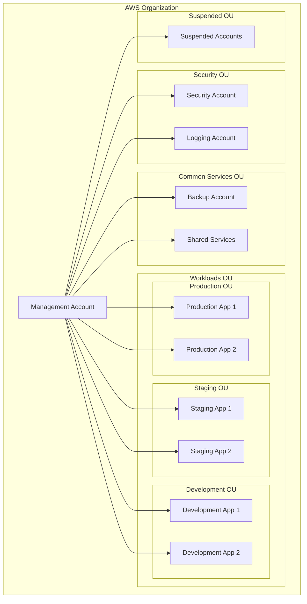

# AWS Account Module - Terragrunt

[](https://github.com/YOUR_GITHUB_USERNAME/aws-account-module-terragrunt/actions/workflows/ci.yml)
[](https://aws.amazon.com/solutions/implementations/aws-landing-zone/)
[](https://cclconsulting.com)
[](https://www.terraform.io/)
[](https://terragrunt.gruntwork.io/)
[](https://registry.terraform.io/providers/hashicorp/aws/latest)
[](LICENSE)
[](./examples/README.md)

> **Enterprise-grade AWS Landing Zone automation with Terragrunt**  
> A comprehensive Terraform module for deploying secure, scalable AWS multi-account environments following AWS best practices and Control Tower governance.

## Overview

This Terragrunt module provides a complete solution for establishing an AWS Landing Zone with Control Tower, enabling organizations to deploy secure, well-architected multi-account environments at scale. Built by CCL Consulting, this module implements AWS best practices for enterprise cloud governance.

###  Key Features

-  **AWS Control Tower Integration** - Automated Landing Zone deployment with guardrails
-  **Multi-Account Architecture** - Secure account isolation following AWS best practices  
-  **Multi-Region Support** - Deploy across multiple AWS regions with centralized governance
-  **Organizational Units** - Structured account organization with workload separation
-  **Security by Design** - Built-in security controls and compliance frameworks
-  **Cross-Account Backup** - Automated backup policies across all accounts
-  **Comprehensive Tagging** - Cost allocation and governance through standardized tagging
-  **Extensive Examples** - Production-ready configurations for various use cases

##  Architecture



## 🚀 Quick Start

### Prerequisites

- **AWS Management Account** with administrative access
- **Email Domain** for account creation (supports `+` addressing)
- **Terraform** >= 1.2.0
- **Terragrunt** >= 0.50.0

### Basic Deployment

1. **Clone and Configure**
   ```bash
   git clone https://github.com/YOUR_GITHUB_USERNAME/aws-account-module-terragrunt.git
   cd aws-account-module-terragrunt
   cp examples/simple-startup.hcl terragrunt.hcl
   ```

2. **Customize Configuration**
   ```hcl
   # terragrunt.hcl
   inputs = {
     email_domain = "your-company.com"
     region       = "us-east-1"
     
     org_accounts = {
       workloads = {
         prod    = ["production-web", "production-api"]
         staging = ["staging-web", "staging-api"]  
         dev     = ["development"]
       }
       common_services = ["shared-services", "monitoring"]
     }
   }
   ```

3. **Deploy**
   ```bash
   terragrunt init
   terragrunt plan
   terragrunt apply
   ```

## Configuration

### Required Variables

| Variable | Description | Type | Example |
|----------|-------------|------|---------|
| `email_domain` | Domain for account emails | `string` | `"company.com"` |

### Optional Variables

| Variable | Description | Type | Default |
|----------|-------------|------|---------|
| `region` | Primary AWS region | `string` | `"eu-west-3"` |
| `backup_region` | Secondary region for backups | `string` | `"eu-west-1"` |
| `governed_regions` | Control Tower managed regions | `list(string)` | `["eu-west-3"]` |
| `email_local_part` | Email prefix for accounts | `string` | `"aws"` |
| `org_accounts` | Account structure definition | `object` | See examples |
| `tags` | Resource tags | `map(string)` | Basic CCL tags |

### Email Configuration

Accounts are created using the format: `{email_local_part}+{account-name}@{email_domain}`

**Examples:**
- `aws+production-web@company.com`
- `aws+security@company.com`
- `aws+logging@company.com`

## 📁 Examples

We provide comprehensive examples for different organizational needs:

| Example | Use Case | Features |
|---------|----------|----------|
| **[Simple Startup](examples/simple-startup.hcl)** | Small organizations | Single region, basic accounts, cost-optimized |
| **[Development Environment](examples/development-environment.hcl)** | Dev/Test environments | Team-based accounts, auto-shutdown policies |
| **[Production Landing Zone](examples/production-landing-zone.hcl)** | Large production | Multi-region, comprehensive governance |
| **[Enterprise Multi-Region](examples/enterprise-multi-region.hcl)** | Global enterprises | Multi-region, business unit organization |

👉 **[View Detailed Examples Documentation](examples/README.md)**

## 🔐 Security & Compliance

### Built-in Security Controls

- ✅ **AWS Control Tower Guardrails** - Preventive and detective controls
- ✅ **IAM Best Practices** - Least privilege access with proper role separation
- ✅ **CloudTrail Logging** - Centralized audit logging across all accounts
- ✅ **AWS Config** - Configuration compliance monitoring
- ✅ **Cross-Account Backup** - Automated backup policies with encryption
- ✅ **Network Security** - VPC isolation and security group controls

### Compliance Frameworks

This module helps achieve compliance with:

- 🏛️ **SOC 2 Type II** - Security, availability, and confidentiality controls
- 🌐 **ISO 27001** - Information security management systems
- 🏦 **PCI DSS** - Payment card industry data security standards
- 🏥 **HIPAA** - Healthcare information protection (when properly configured)
- 🇪🇺 **GDPR** - General Data Protection Regulation compliance

## 🏷️ Tagging Strategy

### Standard Tags Applied

```hcl
tags = {
  # Governance
  "Owner"           = "CCL Consulting"
  "Provisioned by"  = "Terraform"
  "Environment"     = "Production"
  "CostCenter"      = "Infrastructure"
  
  # Security
  "DataClass"       = "Internal"
  "SecurityLevel"   = "High"
  "Backup"          = "true"
  
  # Operations  
  "Monitoring"      = "Enhanced"
  "AutoShutdown"    = "false"
}
```

## 🔧 Advanced Configuration

### Multi-Region Deployment

```hcl
inputs = {
  region = "us-east-1"
  backup_region = "us-west-2"
  governed_regions = [
    "us-east-1",
    "us-west-2", 
    "eu-west-1"
  ]
}
```

### Complex Account Structure

```hcl
inputs = {
  org_accounts = {
    workloads = {
      prod = [
        "prod-web-frontend",
        "prod-api-backend", 
        "prod-data-analytics"
      ]
      staging = [
        "stage-web-frontend",
        "stage-api-backend"
      ]
      dev = [
        "dev-shared",
        "dev-team-alpha",
        "dev-team-beta"
      ]
    }
    common_services = [
      "shared-networking",
      "shared-monitoring", 
      "shared-cicd",
      "shared-dns"
    ]
  }
}
```

## 🧪 Testing

Run the complete test suite:

```bash
# Validate configuration
terragrunt validate

# Security scan
checkov -d . --framework terraform

# Lint code
tflint --recursive

# Test examples
terragrunt plan --terragrunt-config-path examples/simple-startup.hcl
```

## 📊 Monitoring & Observability

### CloudWatch Integration

- 📈 **Cross-Account Dashboards** - Centralized monitoring across all accounts
- 🚨 **Automated Alerting** - Cost, security, and operational alerts
- 📊 **Cost Analytics** - Detailed cost breakdown by account and tag

### AWS Config Rules

- ✅ **S3 Bucket Encryption** - Ensure all buckets are encrypted
- ✅ **Root Access Monitoring** - Alert on root account usage
- ✅ **Security Group Rules** - Validate security group configurations
- ✅ **IAM Policy Compliance** - Check for overly permissive policies

## 🚀 CI/CD Integration

This module includes a comprehensive GitHub Actions workflow:

- ✅ **Terraform Validation** - Syntax and configuration validation
- 🔒 **Security Scanning** - Checkov security analysis
- 📝 **Code Linting** - TFLint code quality checks  
- 🧪 **Example Testing** - Validate all example configurations
- 📦 **Automated Releases** - Semantic versioning and release notes

## 🔄 Migration & Upgrades

### From Existing AWS Accounts

```bash
# Import existing accounts
terragrunt import aws_organizations_account.example 123456789012

# Validate configuration
terragrunt plan
```

### Version Upgrades

```bash
# Update module version
git fetch --tags
git checkout v2.0.0

# Review changes
terragrunt plan

# Apply updates
terragrunt apply
```

## 🐛 Troubleshooting

### Common Issues

| Issue | Solution |
|-------|----------|
| Control Tower not available | Verify region support and account eligibility |
| Email conflicts | Use unique email addresses or subdomain |
| Permission errors | Ensure proper IAM permissions for Organizations |
| State locking | Check DynamoDB table access and state bucket |

### Debug Mode

```bash
# Enable detailed logging
export TF_LOG=DEBUG
export TERRAGRUNT_LOG_LEVEL=debug

terragrunt apply
```

## 📚 Additional Resources

### Documentation

- 📖 **[AWS Control Tower User Guide](https://docs.aws.amazon.com/controltower/)**
- 📖 **[AWS Organizations Best Practices](https://docs.aws.amazon.com/organizations/latest/userguide/orgs_best-practices.html)**
- 📖 **[Terragrunt Documentation](https://terragrunt.gruntwork.io/)**

### AWS Well-Architected

- 🏗️ **[Security Pillar](https://docs.aws.amazon.com/wellarchitected/latest/security-pillar/)**
- 💰 **[Cost Optimization Pillar](https://docs.aws.amazon.com/wellarchitected/latest/cost-optimization-pillar/)**
- ⚡ **[Operational Excellence Pillar](https://docs.aws.amazon.com/wellarchitected/latest/operational-excellence-pillar/)**

## 🤝 Contributing

We welcome contributions! Please see our [Contributing Guide](CONTRIBUTING.md) for details on:

- 🔄 Development workflow
- 📝 Code standards and formatting
- 🧪 Testing requirements
- 📋 Pull request process

## 🆘 Support

### CCL Consulting Support

- 💼 **Enterprise Support**: Contact our cloud architecture team
- 📧 **Email**: [support@cclconsulting.com](mailto:support@cclconsulting.com)
- 🌐 **Website**: [cclconsulting.com](https://cclconsulting.com)

### Community Support

- 🐛 **Issues**: [GitHub Issues](https://github.com/YOUR_GITHUB_USERNAME/aws-account-module-terragrunt/issues)
- 💬 **Discussions**: [GitHub Discussions](https://github.com/YOUR_GITHUB_USERNAME/aws-account-module-terragrunt/discussions)

## 📄 License

This project is licensed under the MIT License - see the [LICENSE](LICENSE) file for details.

## 🙏 Acknowledgments

- **HashiCorp** - For Terraform and Terragrunt
- **AWS** - For Control Tower and Organizations
- **Gruntwork** - For Terragrunt development
- **CCL Consulting** - For module development and maintenance

---

<div align="center">

**⭐ If this module helped you, please consider giving it a star! ⭐**

Made with ❤️ by [CCL Consulting](https://cclconsulting.com)

</div>

<!-- BEGIN_TF_DOCS -->
<!-- This section will be automatically populated by terraform-docs -->
<!-- END_TF_DOCS -->
