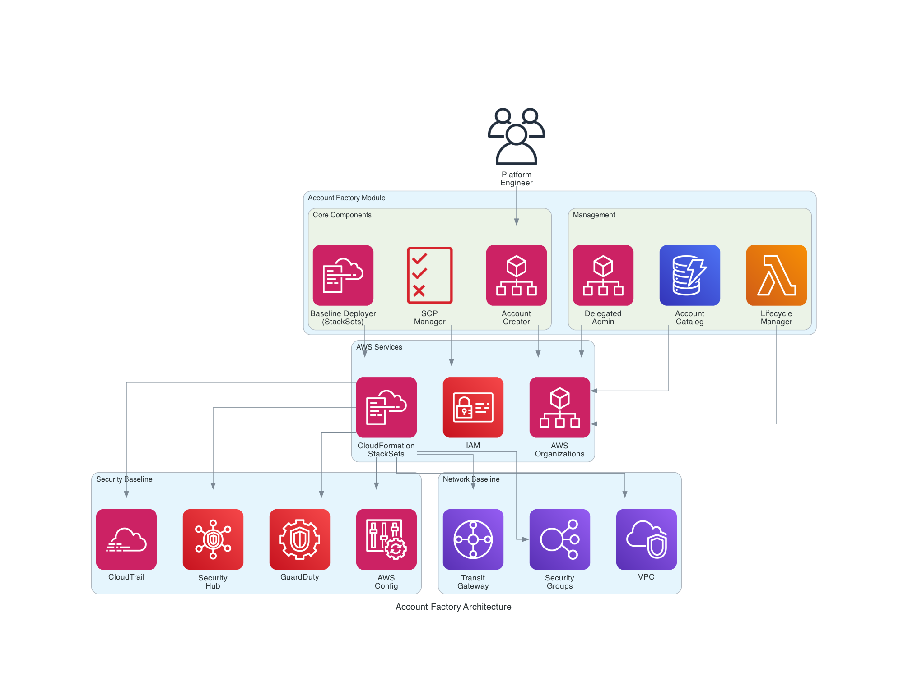
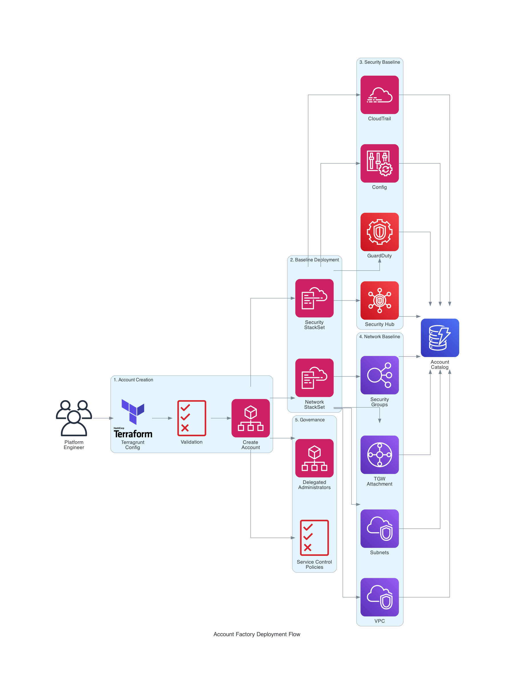

# Account Factory Module

The Account Factory module extends the AWS Landing Zone Terragrunt module to provide automated, declarative account provisioning with standardized security and networking baselines.

## Overview

This module implements an account vending machine pattern that enables platform engineers to:

- Provision AWS accounts through declarative configuration
- Automatically deploy security baselines (IAM roles, Security Hub, GuardDuty, Config, CloudTrail)
- Automatically deploy network baselines (VPCs, Transit Gateway attachments, security groups)
- Manage Service Control Policies across accounts and OUs
- Configure delegated administrators for AWS services
- Track account inventory and baseline versions
- Support baseline versioning with pinned and latest version strategies

## Architecture

The Account Factory uses AWS CloudFormation StackSets to deploy baselines across multiple accounts and regions in parallel, with built-in failure isolation and retry logic.

### Architecture Overview



### Deployment Flow



The deployment process follows these steps:

1. **Account Creation**: Platform engineer defines accounts in Terragrunt configuration → Validation checks → AWS Organizations creates accounts
2. **Baseline Deployment**: CloudFormation StackSets deploy security and network baselines in parallel across all governed regions
3. **Security Baseline**: Deploys Security Hub, GuardDuty, AWS Config, and CloudTrail to each account
4. **Network Baseline**: Creates VPC, subnets, Transit Gateway attachments, and security groups
5. **Governance**: Applies Service Control Policies and configures delegated administrators
6. **Catalog**: All account metadata and baseline versions tracked in the account catalog

## Module Structure

```
account-factory/
├── main.tf                          # Module entry point and orchestration
├── accounts.tf                      # Account creation resources
├── baselines.tf                     # StackSet deployment and cross-account roles
├── service-control-policies.tf      # SCP management
├── delegated-admins.tf              # Delegated administrator configuration
├── outputs.tf                       # Account catalog outputs
├── variables.tf                     # Input variables with validation
├── versions.tf                      # Version constraints
├── data.tf                          # Data sources for existing resources
├── locals.tf                        # Local computations and validations
├── modules/
│   ├── security-baseline/           # Security baseline Terraform module
│   └── network-baseline/            # Network baseline Terraform module
├── templates/
│   ├── security-baseline-stackset.yaml  # CFN template for security
│   └── network-baseline-stackset.yaml   # CFN template for networking
└── examples/
    ├── account-factory-basic.hcl         # Basic 3-account setup
    ├── account-factory-multi-account.hcl # 10+ accounts with for_each
    └── account-factory-custom-baseline.hcl # Custom baselines and versioning
```

## Requirements

| Name | Version |
|------|---------|
| terraform | >= 1.5.0 |
| aws | >= 5.0 |

### Prerequisites

- Existing AWS Landing Zone with Control Tower
- Management account credentials with Organizations admin access
- Logging and Security accounts already provisioned
- Organizational Units created in AWS Organizations

## Usage

### Basic Example

```hcl
terraform {
  source = "..//account-factory"
}

include "root" {
  path = find_in_parent_folders()
}

inputs = {
  management_account_id = "123456789012"
  logging_account_id    = "123456789013"
  security_account_id   = "123456789014"
  governed_regions      = ["us-east-1", "us-west-2"]

  existing_ou_ids = {
    "Development" = "ou-xxxx-11111111"
    "Production"  = "ou-xxxx-33333333"
  }

  accounts = {
    dev-app = {
      email               = "aws-dev-app@example.com"
      organizational_unit = "Development"
      security_baseline   = "default"
      network_baseline    = "standard"
      tags = {
        Owner       = "dev-team@example.com"
        Environment = "development"
        CostCenter  = "engineering"
      }
    }
  }

  network_baselines = {
    standard = {
      version            = "1.0.0"
      vpc_cidr           = "10.0.0.0/16"
      availability_zones = 3
    }
  }
}
```

See `examples/` directory for more comprehensive configurations.
